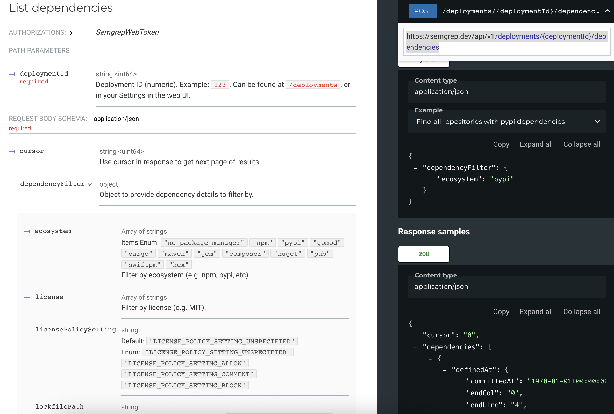

can we add another option to find all dependencies based on license policy

The API to use for this is :
https://semgrep.dev/api/v1/deployments/{deploymentId}/dependencies

Request Body schema: application/json

We will use the following filters

{
  "dependencyFilter": {
    "licensePolicySetting": "LICENSE_POLICY_SETTING_BLOCK"
  }
}

We will generate 2 XLSX files: one for LICENSE_POLICY_SETTING_BLOCK and other for LICENSE_POLICY_SETTING_COMMENT

This is in addition to the existing ouput

if user wants XLSX file for LICENSE_POLICY_SETTING_BLOCK, they should set an environment variable SEMGREP_POLICY_LICENSES_BLOCK to treu in .env file

if user wants XLSX file for LICENSE_POLICY_SETTING_COMMENT, they should set an environment variable SEMGREP_POLICY_LICENSES_COMMENT to treu in .env file