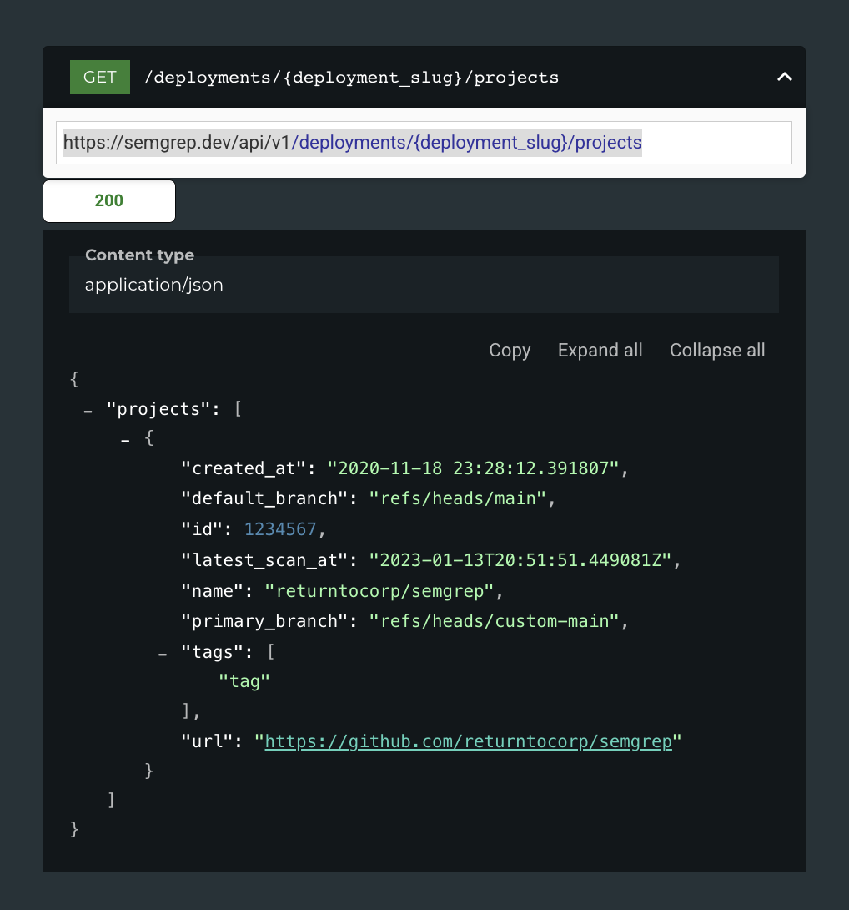
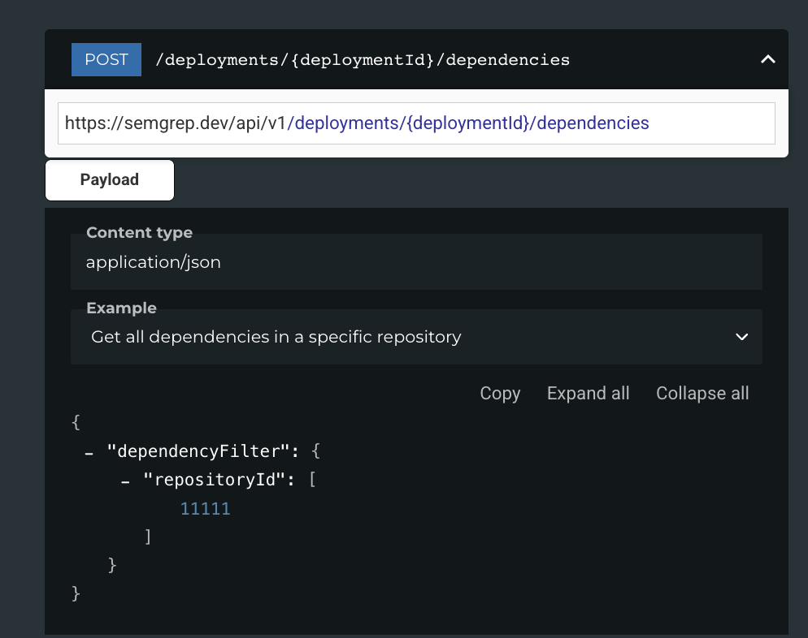
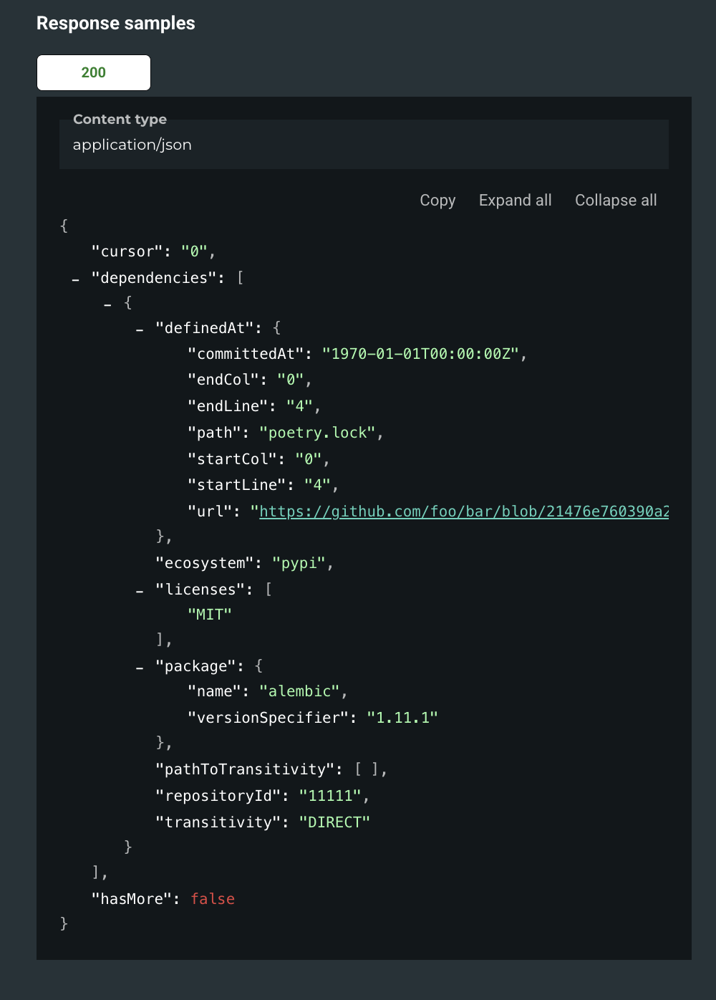

we should create 3 functions in the API_client:
(1) Get list of repos for a given org and write to a list - we can do this using the Semgrep API endpoint: https://semgrep.dev/api/v1/deployments/{deployment_slug}/projects (GET)- the reponse is shown in image: 
(2) We then create an function to get list of deps for a given repo: we can do this using the Semgrep API endpoint: https://semgrep.dev/api/v1/deployments/{deploymentId}/dependencies (POST) and make sure to include the required inputs in the paylod- - the response looks like this - when we write this to a JSON - lets enrich the reponse to add the repo details from the previous call
(3) now to generate a full list of deps, lets call function-1 , write the list of repos to a list and then iterate over that list

Can we create this please as an alternative way to generate list of deps

DO Deep thinking and make sure it does not breakl any other existing functionality

